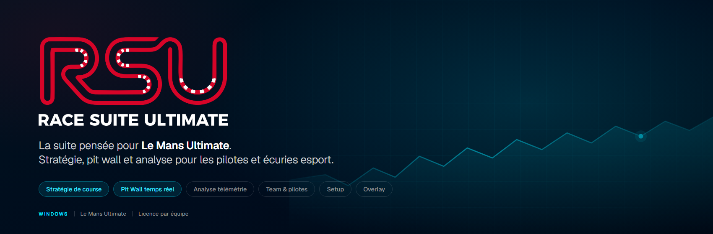
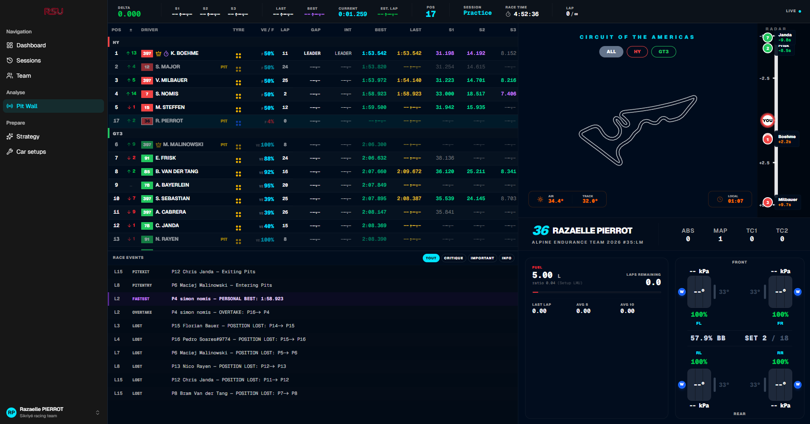
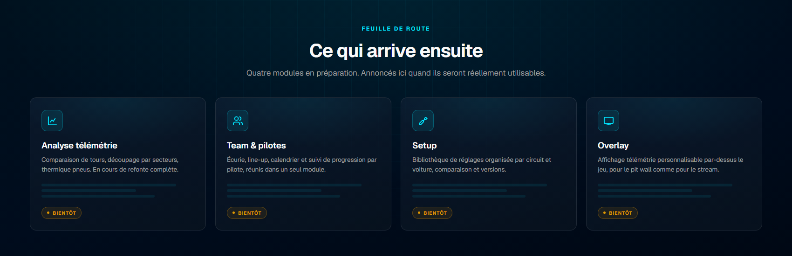

### La suite pensée pour Le Mans Ultimate.

**Stratégie de course · Pit Wall temps réel**

[🌐 Site officiel](https://racesuiteultimate.fr) · [🐞 Signaler un bug](https://github.com/RazaelleCode/race_suite_ultimate/issues)

---

## À propos

**Race Suite Ultimate** est une suite logicielle conçue **exclusivement pour Le Mans Ultimate (LMU)**, à destination des pilotes compétitifs et des équipes esport. L'objectif : préparer une course sérieusement, puis la piloter depuis le muret, sans quitter l'outil.

> Le code source de ce projet est **fermé** (produit commercial). Ce repository sert de **vitrine publique** et de **canal officiel de remontée de bugs et de suggestions**.

**L'application est en développement actif.** Deux modules sont aujourd'hui utilisables ; les autres sont annoncés plus bas et arriveront quand ils seront réellement au niveau — pas avant.

 

## Disponible aujourd'hui

### 🏁 Stratégie de course

Planification des relais à partir d'une séance réellement roulée : consommation mesurée, rythme de référence, découpage en relais, profil carburant et contrôle de faisabilité. Le plan annonce le **niveau à composer dans le menu du stand**, pas un ajout — c'est ce que demande LMU.

 <i>Aperçu de l'interface — rendu reconstruit depuis le code de l'application.</i>

 

### 🧭 Pit Wall

Le muret pendant la course : classement et écarts, relais en cours, carburant et énergie virtuelle à bord, températures et usure pneus, journal des événements, courbe de rythme, et la fenêtre du prochain arrêt. La longueur d'une course en durée y est **estimée au rythme mesuré** et présentée comme telle — le jeu ne la publie pas.

 <i>Aperçu de l'interface — rendu reconstruit depuis le code de l'application.</i>

 

## Ce qui arrive ensuite

| Module | État |
|---|---|
| 📊 **Analyse télémétrie** | Comparaison de tours, secteurs, thermique pneus. En refonte complète avant d'être proposée. |
| 👥 **Team & pilotes** | Écurie, line-up, calendrier et suivi de progression, réunis en un seul module. |
| 🎯 **Setup** | Bibliothèque de réglages par circuit et voiture, comparaison et versions. |
| 🖥️ **Overlay** | Affichage télémétrie par-dessus le jeu, pour le pit wall comme pour le stream. |

 

## Téléchargement

Race Suite Ultimate sera distribué sous **licence B2B, par siège ou par équipe**.

| | |
|---|---|
| 🌐 **Site officiel** | [racesuiteultimate.fr](https://racesuiteultimate.fr) |
| ⬇️ **Télécharger l'exécutable** | *Bientôt disponible* — les versions seront publiées dans [Releases](https://github.com/RazaelleCode/race_suite_ultimate/releases) |
| 💬 **Démo ou offre équipe** | Via [racesuiteultimate.fr](https://racesuiteultimate.fr) |

 

## Signaler un bug ou proposer une amélioration

Les retours utilisateurs sont essentiels au développement de l'outil. Utilise l'onglet **[Issues](https://github.com/RazaelleCode/race_suite_ultimate/issues)** de ce repository pour :

- 🐞 **Signaler un bug** — merci de préciser la version de l'app, la version de LMU, et les étapes de reproduction
- 💡 **Proposer une fonctionnalité**
- ❓ **Poser une question** sur l'utilisation

 

## Licence

Ce projet est un **logiciel propriétaire**. Le code source n'est pas distribué publiquement. Pour toute demande de licence ou de partenariat, passe par [racesuiteultimate.fr](https://racesuiteultimate.fr).

---

Race Suite Ultimate — conçu pour et par des passionnés de Le Mans Ultimate.

